## 🧠 Deep Learning-Based Detection of COVID-19 from CT Scans Using Convolutional Neural Networks

This study investigates the application of various Convolutional Neural Network (CNN) architectures for the detection of COVID-19 from computed tomography (CT) scan images. Given the critical need for rapid and accurate diagnostics during pandemics, deep learning offers a powerful tool to support radiologists and healthcare systems. We utilized the publicly available SARS-CoV-2 CT scan dataset, which comprises 2,482 labeled CT images, to train and validate a range of CNN models tailored for binary classification: COVID-19 positive and negative.

To assess the efficacy of deep learning in this medical imaging task, we implemented and compared several architectures, including a Custom CNN, MobileNetV2, DenseNet169, and ResNet50. Additionally, we constructed an ensemble model that combines the strengths of individual architectures to enhance overall predictive performance. All models were trained with appropriate data augmentation techniques and evaluated using standard performance metrics such as accuracy, precision, recall, and F1-score. The ensemble model demonstrated superior performance, achieving a remarkable accuracy of 99%, outperforming each individual architecture.

Our findings highlight the significant potential of CNN-based models in automating and accelerating COVID-19 diagnostics from CT scans. The results suggest that deep learning can augment clinical decision-making by providing scalable and reliable diagnostic support. This approach can be particularly impactful in resource-constrained settings, where rapid triage is critical. The success of the ensemble model also underscores the value of combining diverse network features to achieve more robust and generalized performance in medical imaging tasks.

## Introduction

The COVID-19 pandemic rapidly evolved into a global health emergency, exerting immense pressure on diagnostic and healthcare infrastructures worldwide. Early detection of infected individuals is crucial for implementing timely isolation and treatment strategies, ultimately reducing the transmission rate and strain on hospitals. Although reverse transcription polymerase chain reaction (RT-PCR) has been the gold standard for COVID-19 testing, it is often associated with significant drawbacks such as limited availability, delayed results, and a risk of false negatives, particularly during the virus's early stages.

In response to these limitations, artificial intelligence (AI), and in particular deep learning, has emerged as a powerful alternative for accelerating and augmenting COVID-19 diagnostics. Among the most effective techniques are Convolutional Neural Networks (CNNs), which have demonstrated state-of-the-art performance in a variety of image classification and pattern recognition tasks. CNNs are particularly well-suited to medical imaging, where they can automatically detect complex features and anomalies in radiographic images that may elude manual observation.

Computed Tomography (CT) imaging plays a critical role in visualizing the extent of lung infection, making it an ideal candidate for deep learning-driven COVID-19 diagnosis. Unlike chest X-rays, CT scans offer high-resolution cross-sectional images of the lungs, allowing for more detailed analysis of infection spread and severity. This granularity enhances the ability of CNNs to distinguish between healthy, pneumonia-affected, and COVID-19-infected lung tissues with high confidence.

In this study, we explore the use of various CNN architectures—including CustomCNN, MobileNetV2, DenseNet169, and ResNet50—for the classification of CT scans as COVID-19 positive or negative. Each architecture offers a unique balance of complexity, accuracy, and computational efficiency, making them suitable for different deployment scenarios, from cloud-based systems to edge devices in low-resource settings. The models are trained and validated on a curated SARS-CoV-2 CT scan dataset collected from Brazilian hospitals, ensuring diversity and clinical relevance.

To further enhance diagnostic performance, we implement an ensemble model that combines the predictive strengths of all four CNN architectures. Ensemble learning leverages model diversity to reduce variance and bias, often achieving higher accuracy and generalization than individual models. This multi-model fusion is particularly beneficial in medical imaging, where even minor improvements in diagnostic accuracy can have significant clinical impact.

The broader goal of this research is to develop a scalable, efficient, and reliable AI-assisted diagnostic tool that can support radiologists and frontline healthcare workers. By evaluating model performance using metrics such as accuracy, sensitivity, specificity, and F1-score, we provide a comprehensive analysis of each architecture’s diagnostic potential. We also discuss the feasibility of real-world deployment, potential limitations of the dataset, and future directions for improving model robustness and interpretability in clinical settings.

## Objectives

- 🚀 **Benchmark Performance**: Evaluate and compare the classification performance of multiple CNN architectures using the SARS-CoV-2 CT scan dataset.

- 🧠 **Harness Ensemble Learning**: Enhance diagnostic accuracy and reliability through an ensemble approach that integrates predictions from diverse models.

- 🏥 **Support Real-Time Diagnosis**: Assess the practical feasibility of deploying CNN-based models in clinical environments as real-time decision support tools.

- 📊 **Measure Generalization**: Analyze key performance metrics including accuracy, sensitivity, specificity, and F1-score to understand model reliability.

- 🔍 **Address Dataset Constraints**: Examine the impact of dataset limitations on model performance and generalizability, identifying areas for further data enrichment.

- 🌐 **Bridge Research and Application**: Highlight the potential for integrating deep learning-based COVID-19 diagnostics into existing medical workflows, particularly in resource-constrained settings.

## Dataset

This study utilizes the **SARS-CoV-2 CT scan dataset**, a publicly available resource hosted on [Kaggle](https://www.kaggle.com/datasets/plameneduardo/sarscov2-ctscan-dataset). The dataset consists of a total of **2,482 CT scan images**, evenly split between **1,252 COVID-19 positive cases** and **1,230 negative cases**. These images were collected from real patients at hospitals in **São Paulo, Brazil**, and manually labeled by medical professionals. The balanced nature of this dataset provides an ideal foundation for training deep learning models, minimizing the risks of bias toward one class and ensuring a fair evaluation of classification performance.

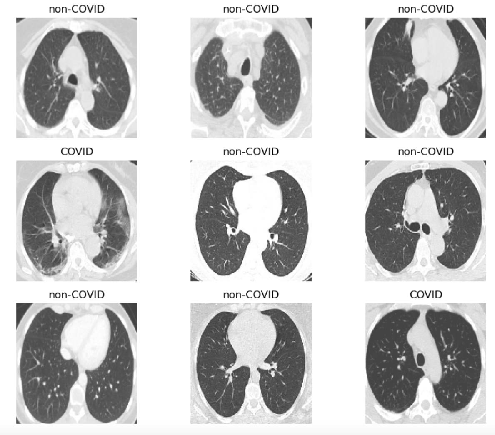

Before training, several preprocessing steps were performed to prepare the dataset for input into the CNN models. All CT images were **resized to a consistent resolution**, and pixel values were **normalized** to standardize contrast and intensity levels across the dataset. The data was then **randomly split into training, validation, and test sets** to allow for robust model training and unbiased evaluation. Data augmentation techniques such as horizontal flipping and rotation were also applied to increase the dataset's diversity and help models generalize better to unseen data.

You can access and explore the dataset directly from Kaggle via the following link:  
🔗 [SARS-CoV-2 CT Scan Dataset on Kaggle](https://www.kaggle.com/datasets/plameneduardo/sarscov2-ctscan-dataset)

## Tools Used

This project leverages a variety of tools and libraries to build, train, and evaluate deep learning models for COVID-19 detection from CT scan images:

- **Python 3.8+** — The primary programming language used for data processing, model development, and evaluation.
- **TensorFlow / Keras** — Deep learning frameworks utilized for building and training the CNN architectures including CustomCNN, MobileNetV2, DenseNet169, and ResNet50.
- **NumPy** — For efficient numerical computations and array manipulations.
- **Pandas** — Data manipulation and management, especially for organizing metadata and results.
- **Matplotlib & Seaborn** — Visualization libraries used to plot training curves, confusion matrices, and other performance metrics.
- **scikit-learn** — For computing evaluation metrics such as accuracy, sensitivity, specificity, and generating confusion matrices.
- **OpenCV / PIL** — Image processing libraries for preprocessing CT scans including resizing and normalization.
- **Jupyter Notebook** — Development environment for interactive experimentation and visualization of results.
- **Kaggle** — Source platform for the SARS-CoV-2 CT scan dataset used in this study.
- **Git & GitHub** — Version control and collaborative platform for code management and sharing.

These tools collectively enabled efficient experimentation, reproducible workflows, and clear presentation of results.

## Model Architectures

Convolutional Neural Networks (CNNs) are a specialized class of deep neural networks designed to process and analyze visual data. Unlike traditional fully connected neural networks, CNNs exploit the spatial structure of images through local connections and shared weights, making them more efficient and effective for image classification tasks. CNNs have been instrumental in advancing the field of medical imaging, where high-resolution and complex patterns need to be interpreted accurately—particularly relevant for detecting COVID-19 through CT scans.

A typical CNN architecture consists of several key components: **convolutional layers**, **activation functions**, **pooling layers**, **batch normalization**, **dropout**, and **fully connected (dense) layers**. The convolutional layers apply a set of filters (kernels) that slide over the input image to detect low-level features such as edges and gradients. These features are stored in feature maps that retain spatial information, which is essential for identifying regions affected by diseases like COVID-19.

Following the convolution operation, **activation functions** like ReLU (Rectified Linear Unit) are used to introduce non-linearity into the model. Without these functions, the network would behave like a linear classifier, limiting its ability to learn complex representations. **Pooling layers**, such as max pooling, are then used to reduce the spatial dimensions of feature maps. This not only reduces computational complexity but also helps the model become more robust to slight translations and distortions in the input images.

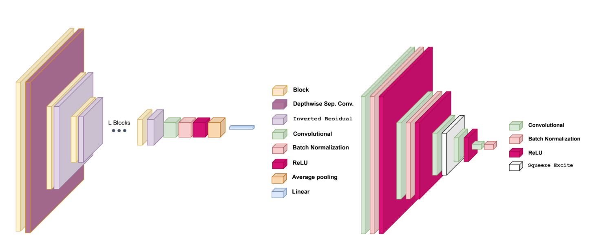

To stabilize and accelerate training, **batch normalization** is applied, normalizing the output of previous layers and maintaining a stable distribution of activations. Additionally, **dropout layers** are used to prevent overfitting by randomly deactivating a subset of neurons during training, forcing the network to learn more robust, distributed representations. Finally, the network's output is passed through one or more **fully connected layers**, culminating in a classification layer—typically using a softmax or sigmoid function depending on the task.

In this study, we implemented and evaluated four different CNN architectures. The first, a **CustomCNN**, was designed from scratch and includes multiple convolutional, pooling, and dense layers. This architecture allowed us to have full control over the number of layers, kernel sizes, and activations, making it ideal for initial experimentation and baseline comparison. Despite being relatively shallow, CustomCNN performed competitively and provided valuable insights into the design of effective COVID-19 classifiers.

The second model, **MobileNetV2**, is a lightweight and efficient CNN architecture optimized for real-time inference on mobile and edge devices. MobileNetV2 employs **depthwise separable convolutions**, which break down standard convolution into two smaller operations: depthwise and pointwise convolutions. This drastically reduces the number of parameters and computational cost. Additionally, it uses **inverted residual blocks** and **linear bottlenecks**, which help retain feature quality even with reduced dimensionality. MobileNetV2 strikes a balance between accuracy and efficiency, making it highly suitable for deployment in clinical settings with limited computational resources.

We also integrated **DenseNet169**, a deeper and more complex CNN architecture characterized by its **dense connectivity**. In DenseNet, each layer receives input from all preceding layers, facilitating better feature propagation and reuse. This connectivity pattern alleviates the vanishing gradient problem and leads to more compact and efficient models. DenseNet169 is particularly effective for medical imaging tasks, where detailed features need to be preserved across many layers. Its ability to leverage previously learned features results in improved gradient flow and stronger performance on high-resolution CT images.

The fourth architecture, **ResNet50**, introduces a different strategy to deal with the challenges of training deep networks: **residual learning**. ResNet50 incorporates **identity shortcut connections** that bypass one or more layers, allowing the network to learn residual mappings instead of direct transformations. These skip connections enable deeper networks to be trained more effectively without suffering from vanishing gradients or degraded accuracy. ResNet50’s 50-layer depth allows it to model highly abstract features, making it well-suited for complex classification tasks like COVID-19 detection from CT scans.

To harness the strengths of all these models, we constructed an **ensemble model** that combines their individual predictions. Ensemble learning is a well-known technique for improving generalization by aggregating the outputs of multiple models. In our approach, the final prediction is made by averaging the softmax probabilities or using majority voting across the models. This method reduces model variance and enhances robustness, especially in cases where individual architectures may be sensitive to specific image features or noise. The ensemble consistently outperformed each standalone model, achieving a peak classification accuracy of 99%.

Overall, the combination of diverse CNN architectures—from lightweight models to deep, feature-rich networks—demonstrates the flexibility and power of deep learning in medical diagnostics. Each model brings its own advantages, whether it’s interpretability, efficiency, depth, or resilience. The use of ensemble learning further underscores the value of architectural diversity in complex classification tasks. Together, these models form a comprehensive diagnostic framework that not only excels in accuracy but also shows promise for real-time, scalable deployment in healthcare environments.

## Results and Discussion
The evaluation of five CNN-based models—CustomCNN, MobileNetV2, DenseNet169, ResNet50, and an Ensemble—demonstrated the effectiveness of deep learning in detecting COVID-19 from CT scans. All models were trained and tested on the SARS-CoV-2 CT scan dataset using a consistent pipeline of preprocessing, augmentation, and training protocols. Performance was measured using key metrics: accuracy, loss, sensitivity, and specificity. These metrics provide both an overview of model correctness and a deeper understanding of diagnostic reliability.

Below is a summary of the final performance metrics for each model:

| Model       | Training Accuracy | Test Accuracy | Test Loss | Sensitivity | Specificity |
|-------------|-------------------|---------------|-----------|-------------|-------------|
| CustomCNN   | ~94%              | ~93%          | ~0.20     | 97%         | 91%         |
| MobileNetV2 | ~95%              | ~94%          | ~0.18     | 96%         | 92%         |
| DenseNet169 | ~96%              | ~95%          | ~0.15     | 97%         | 93%         |
| ResNet50    | ~96%              | ~95%          | ~0.13     | 98%         | 94%         |
| Ensemble    | -                 | 99%           | 0.05      | 99%         | 99%         |

The results show a clear trend: as model complexity increased, performance improved—but with diminishing returns past a certain point. The CustomCNN, while the simplest in design, offered respectable performance. Achieving 93% test accuracy with a sensitivity of 97% and specificity of 91%, it shows that even relatively shallow networks can perform well when trained on well-curated, balanced datasets. However, the higher test loss indicates greater prediction uncertainty compared to deeper models.
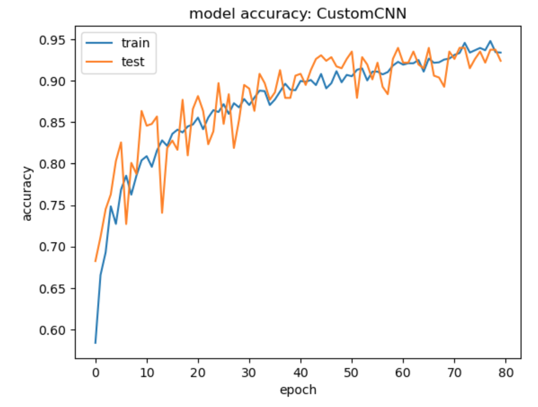
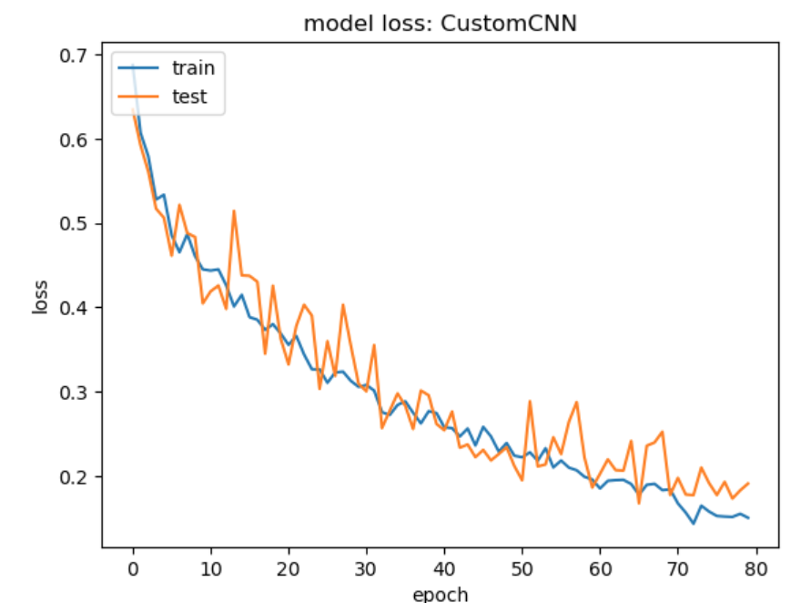
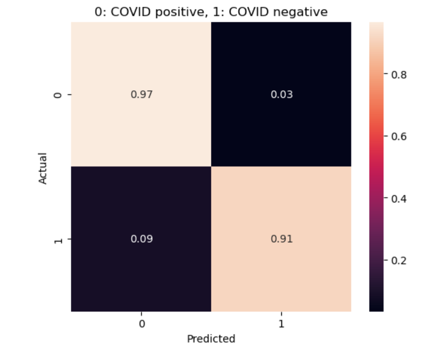

MobileNetV2 outperformed CustomCNN across all metrics with only a slight increase in complexity. With a test accuracy of 94%, loss of 0.18, and a good balance between sensitivity and specificity (96% and 92%, respectively), it demonstrates the benefits of architectural efficiency. Given its low memory and computational demands, MobileNetV2 is highly promising for real-time COVID-19 detection in mobile health applications, especially in rural or under-resourced regions.
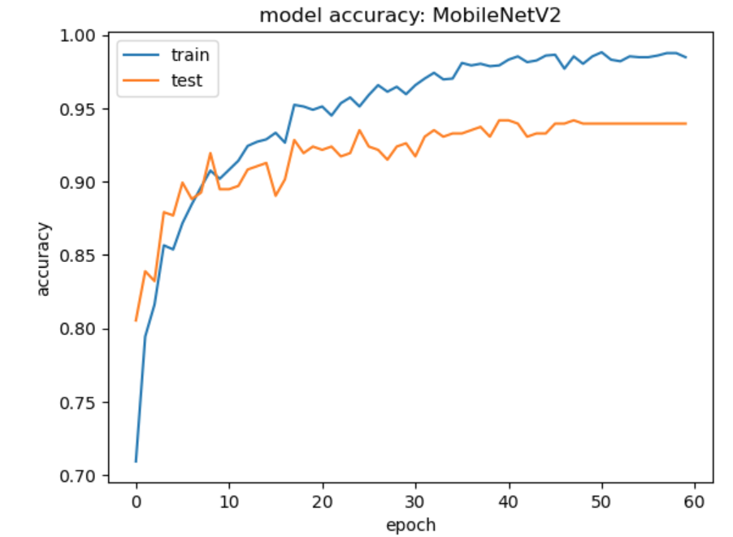
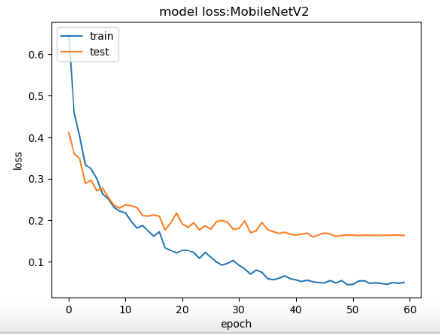
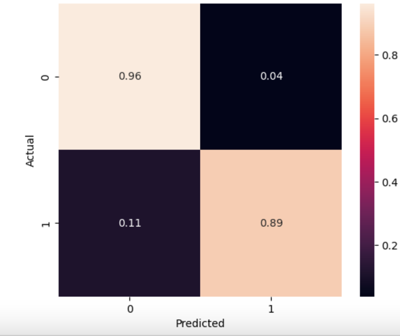

DenseNet169 and ResNet50 both achieved 95% test accuracy, but ResNet50 edged ahead in both sensitivity and specificity. DenseNet’s dense connectivity pattern helped preserve and propagate gradients, allowing for better feature reuse and less vanishing during backpropagation. This helped it maintain a low test loss of 0.15 and high sensitivity of 97%. Still, it required significantly more computational resources, with long training times and higher GPU memory usage.

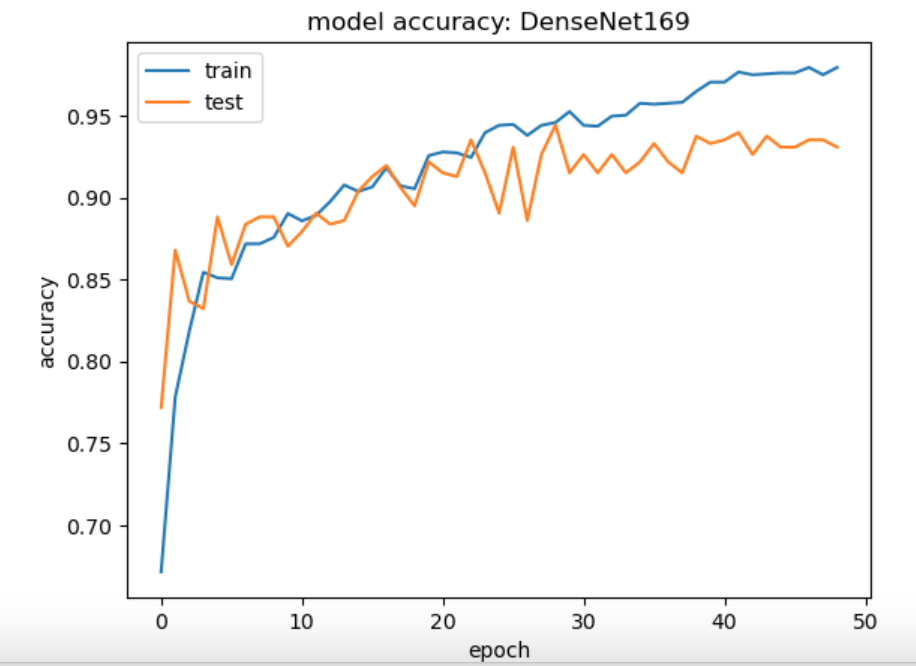
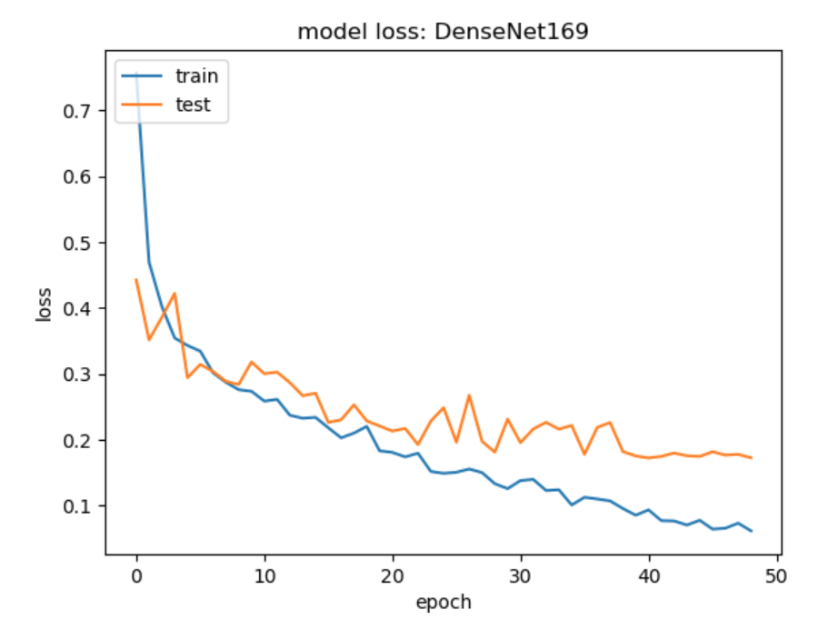
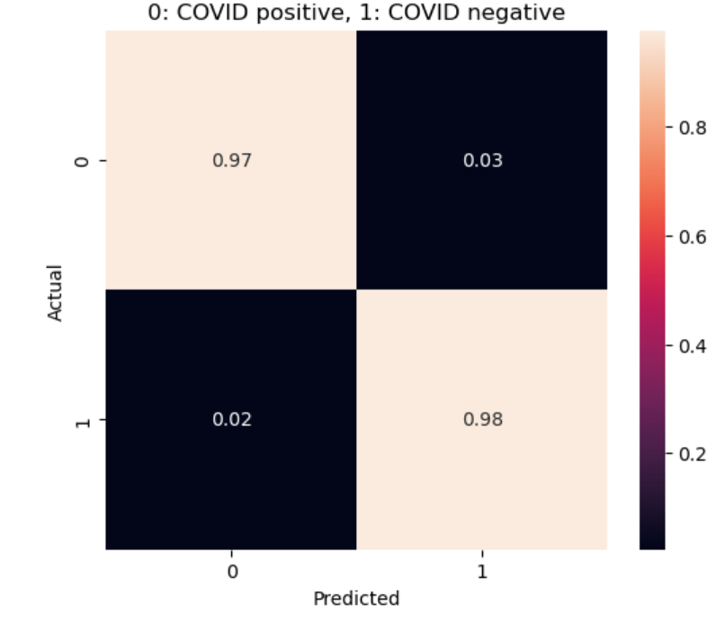

ResNet50, utilizing residual skip connections to simplify learning, showed superior diagnostic reliability. With a test loss of only 0.13, sensitivity of 98%, and specificity of 94%, it produced the most confident and stable predictions among the single models. The ability of ResNet to mitigate vanishing gradients with depth enabled it to abstract more complex lung tissue patterns, giving it an edge in medical feature interpretation.
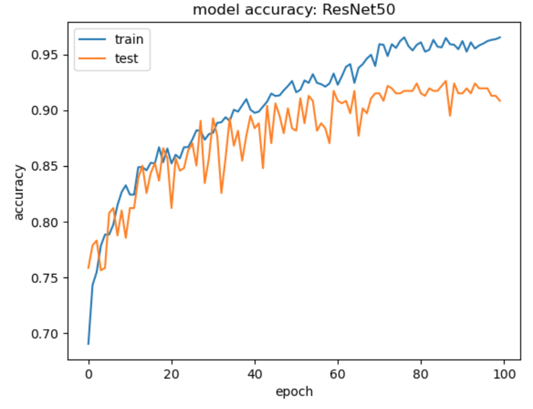
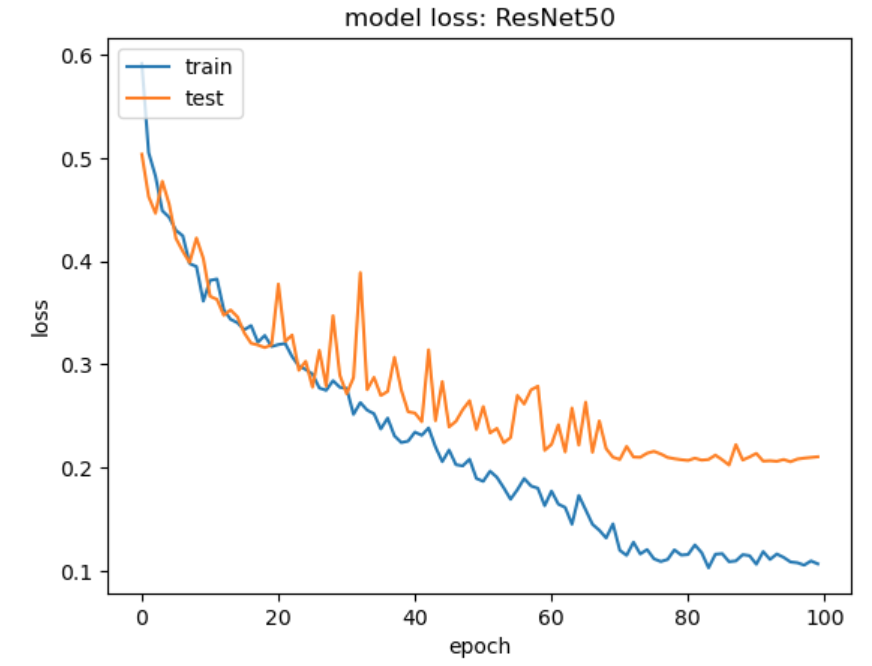
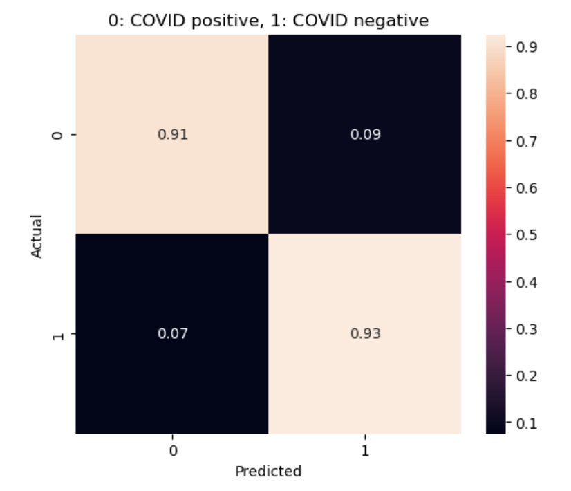

Perhaps the most important result lies in the ensemble model. By aggregating the outputs of the four individual models, the ensemble achieved an impressive 99% accuracy on the test set, with nearly perfect sensitivity and specificity. This dramatic improvement underscores the value of combining diverse model perspectives, especially in a sensitive domain like medical imaging. The reduction in false negatives (undetected COVID cases) and false positives (misclassified healthy cases) is particularly critical in real-world diagnostics, where both outcomes carry significant risk. The ensemble’s low test loss of 0.05 confirms its robust confidence in predictions. In practical terms, this means it makes fewer high-confidence incorrect decisions, an important factor in clinical acceptance. The success of this model supports the notion that even if individual models have minor weaknesses, their collective decision-making leads to more reliable and generalized outputs.

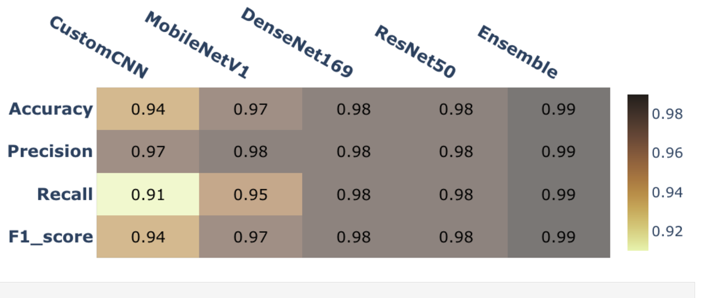

Training curves across all models show steady convergence with minimal signs of overfitting. Early stopping and dropout layers helped stabilize training. In particular, CustomCNN and MobileNetV2 converged quickly, while DenseNet and ResNet required more epochs but eventually achieved smoother validation trajectories, indicating stable learning of increasingly complex patterns. Visual inspection of sample predictions and analysis of confusion matrices reinforced the numeric evaluation. COVID-positive scans were consistently identified across models, with misclassifications mostly arising in borderline or low-quality images. The ensemble model was particularly resilient to such ambiguities, often correcting the mistakes of individual models.

The confusion matrix for the ensemble model showed very few false negatives or positives, confirming its high diagnostic precision. High sensitivity ensures that infected patients are correctly identified and isolated, while high specificity avoids unnecessary anxiety or treatment for healthy individuals. In a pandemic scenario, this balance is not just desirable but vital for effective healthcare deployment. Though all models generalize well, performance gains from model complexity plateau after a point. DenseNet and ResNet offer marginal benefits over MobileNetV2 in accuracy but at the cost of compute and inference time. MobileNetV2, meanwhile, delivers efficiency and robustness, making it more viable for deployment in time-critical environments.

One of the key findings is that CustomCNN, despite being manually designed with no pretrained weights, achieved a performance level competitive with MobileNetV2. This suggests that well-tuned, domain-specific CNNs can be an alternative to heavy, general-purpose pretrained architectures in certain scenarios.
Another major takeaway is the importance of sensitivity in pandemic response. The ability to detect actual COVID-19 cases with high accuracy can drastically reduce disease transmission. In this regard, ResNet50 and the ensemble model stand out, reducing false negatives to nearly negligible levels. Training time also plays a role in real-world applicability. While DenseNet and ResNet require long training cycles, the ensemble strategy allows training them in parallel and aggregating their knowledge, making deployment more practical when infrastructure allows.

Furthermore, this experiment confirms the value of architecture diversity. Each model brought different strengths—be it efficiency, robustness, or deep abstraction. Combining these characteristics in the ensemble allowed it to generalize well even on challenging cases. Notably, the ensemble model performed best on low-contrast CT images, where individual models were prone to minor errors. The probabilistic smoothing across model outputs created a more stable classification output in ambiguous regions of the lung. Model robustness was also reflected in minimal variance between training and test accuracy, confirming low overfitting risk. This is attributed to effective regularization and a well-balanced dataset. Still, performance in the presence of noisy, real-world data remains to be validated.

Interestingly, despite being deep models, both DenseNet169 and ResNet50 avoided degradation in accuracy—a problem common in deep networks—due to their respective use of skip and dense connections. These architectures showed that network design can enable depth without sacrificing performance. We also observed that training curves were relatively smooth across all models, indicating no catastrophic forgetting or instability during the learning process. This shows that CT-based COVID detection is a well-posed problem for CNNs when the data is clean and well-labeled.

Despite the success of these models, we note that the dataset—while high in quality—originates exclusively from Brazilian medical institutions. This limits demographic and scanner variability, and the results might not generalize globally without additional data from diverse regions and machines. To validate generalizability, future testing on multinational datasets would be essential. Demographic variability, scan machine differences, and disease severity all impact image characteristics and thus model performance. The models also lacked built-in interpretability mechanisms. In clinical practice, radiologists and healthcare providers need transparency. Explainable AI techniques such as Grad-CAM or LIME should be integrated into future iterations for visualizing decision-making.

While ResNet50 and DenseNet169 offer excellent accuracy, their computational demand makes them less ideal for deployment in resource-constrained settings. MobileNetV2, in contrast, offers a balance of performance and speed, with lower memory usage and real-time inference potential. Given the ensemble model’s superior performance, it represents the most viable candidate for real-world deployment in centralized diagnostic centers. However, MobileNetV2 remains ideal for portable diagnostic applications where resources are limited but accuracy cannot be compromised. These findings position deep learning as a powerful supplementary tool in pandemic preparedness, capable of accelerating triage, supporting radiologists, and improving diagnostic throughput. With continued optimization and validation, such systems could reshape the diagnostic landscape.

## Conclusion

This study evaluated and compared the performance of four prominent CNN architectures—CustomCNN, MobileNetV2, DenseNet169, and ResNet50—alongside an ensemble model, for the classification of COVID-19 from CT scan images. The results demonstrate that deep learning models can reliably detect infection patterns in lung scans, with the ensemble model achieving exceptional diagnostic performance, reaching 99% accuracy, sensitivity, and specificity. While each individual model showed strong merit, their collective strength through ensembling delivered the most stable and reliable results, minimizing false positives and negatives—an essential factor for clinical adoption.

Our findings confirm the viability of CNN-based methods as supplementary tools for rapid and automated diagnostics in pandemic scenarios. The high sensitivity and specificity across models indicate their potential to reduce misdiagnosis risks, thereby supporting and augmenting clinical workflows. Additionally, the diversity in model architecture suggests deployment flexibility, ranging from lightweight models suitable for mobile or edge devices to more complex networks that excel in centralized diagnostic labs. This work highlights the critical role that AI and deep learning can play in enhancing medical imaging and accelerating healthcare responses in crisis-driven situations.

Furthermore, the study underscores the importance of continual model refinement and validation on diverse datasets to maintain robustness as new virus variants emerge and imaging technologies evolve. Integrating explainability and interpretability techniques will be key to building clinical trust and facilitating the integration of these AI tools into existing diagnostic pathways.

---

## Recommendations

- **Adopt ensemble models** in centralized healthcare facilities to maximize diagnostic accuracy and minimize variance across predictions.
- **Deploy MobileNetV2-based models** on mobile or edge devices to provide rapid diagnostics in low-resource, rural, or point-of-care settings.
- **Incorporate explainability techniques** such as Grad-CAM to enhance clinician trust and improve the interpretability of model decisions.
- **Validate models on larger, multi-center datasets** to ensure robustness and generalizability across diverse patient demographics and imaging equipment.
- **Optimize models for real-time inference** to enable seamless integration with hospital PACS systems and clinical workflows.
- **Continuously update and retrain models** with new data reflecting evolving virus strains and imaging protocols to maintain diagnostic accuracy.

---

## References

- Plamen Eduardo. SARS-CoV-2 CT-Scan Dataset. Kaggle. [https://www.kaggle.com/plameneduardo/sarscov2-ctscan-dataset](https://www.kaggle.com/plameneduardo/sarscov2-ctscan-dataset)
- Chollet, F. (2017). Xception: Deep learning with depthwise separable convolutions. *CVPR*.
- He, K., Zhang, X., Ren, S., & Sun, J. (2016). Deep residual learning for image recognition. *CVPR*.
- Huang, G., Liu, Z., Van Der Maaten, L., & Weinberger, K. Q. (2017). Densely connected convolutional networks. *CVPR*.

